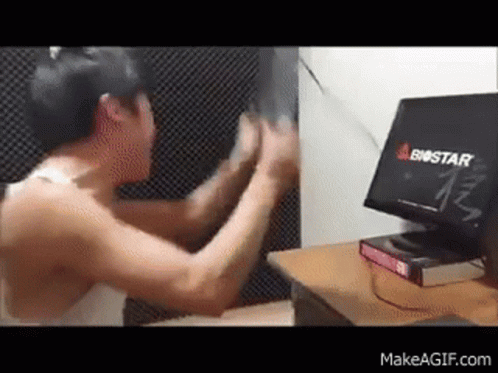
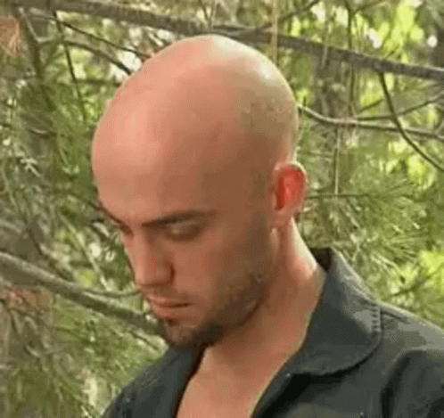
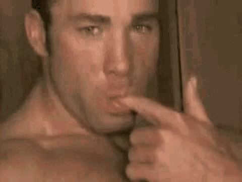

для анализа метаданых я взял фотку из своей инсты

использовал сайт http://metapicz.com/#landing 

также я взял фотку с моего vk

ну просмотрев фоток 30 я вообще не нашел метаданых 

вобщем я решил сделать фото и сразу на телефоне посмотреть метаданные

т.к соц сети удаляют метаданные 

и получил это

а ещё мне стало интересно что покажут метаданые с телефона на котором есть не ориг гугл камера

изменения были только в пунтке програмного обеспечиния 

т.е в ориг камере версия прошивки смарта,а в случае гугл камеры версия HDR+ билда

не особо интересное иследование ну да ладно 

так дальше фока 

ну я взял unknowncheats.me

фока ничего не нашла справедливо

потом взял betterdiscord.net 

тоже  ничего 

andrax.thecrackertechnology.com

ничего

steamcommunity.com

ничего

mrdeepfakes.com

ничего

ладно думаю возьму проверю по mirea.ru

а чё а всмысле
 
спустя два часа и одну переустановку SQL о боже оно заработало 

ну а я че парень простой

пробил steamdb.info

ничего

пробил mirea.ru

ничего

крута класс

балдеж ограничение на запросы -_-

ну вот анализ стим дб онли html 

короче принцип работы фоки ясень,но инструмент специфичный

дальше ccleaner призираймая мною программа 

дубликат файлов можно создать и самому, удаление в cc такое себе, чистка реэстра им скорее винду положит чем поможет

вобще все нужны утили в обычном таком плане можно взять из window repair toolbox

фаст копи для копирования и востановления 

рег сикер для реестра рево для удаления программ 

авторан для чистки автозагрузки полностью

также в рево есть свой контроль автозапуска удаления без возможности востановления 

чистка мусора 

в тысяча раз лучше cc

например удаление

вот беру юзлес мусор

во первых мне прдлагают точку востановления 

во вторых обычный деинсталятор 

в третих проверка реестра и остаточных файлов программы 

ну и всё реестр чист, файлов нет 

ну дальше востановление и затирание окей

есть значит два стула

значит я просто удалил одну пикчу, вторую удалил через revo 

запустил 

recuva и понял

надо бы новую папку создать и там это делать 

ну сделал повторил

ииии ничего не поменялось ладно подождём 

мое лицо после конца сканирования файлов

ибо сейчас время сканирования такое 

ладно тестовых файлов там не было но было куча других

в итоге я решил через рево удалить вообще все остатки удаленной информации

точнее вот что нашла рекува до зачистки диска 

 

куча файлов тхтхи пдфки артики там всякие ну понятно дело я их без труда могу сейчас востановить ибо через корзину удалял

вообще пока идёт процес опишу принцип действия

его и так каждый ламер знает 

типо если удалять через корзину то файлы легко востановить

если затирать то сложнее ибо данных меньше остаётся

ну тоесть чем раньше ты захотел востановить удалёный файл 

и чем меньше было перезаписей на диске

тем больше шанс что данные можно востановить

обычно там потери данных  вообще минимальные 

так что обычный юзер который что-то по ошибке удалил может это востановить

ну а по скольку у меня диски файло помойка для игр и артов то почистить следы от них

звучит хайпова

ну и вот что что стало после зачистки 

список файлов остался но востановление ничего не давало

предосомтр не работал

тот фал удаленный с артиком что до этого можно было востановить теперь был безвозвратно потерян

ну можно считать что информация успешно затерта

хотя если её надо востановить её востановят ибо какие некакие следы то остались 

потыкав ещё минутку я обнаружил

что правильно

тестовые файлики ваууу

 ну чтож даже задание практики выполнил удивительно
 
 
 
 
 я ещё мне пришло озарение на фоку и я пробил apple.com
 
 и о боже ещё одно выполненное задание файлы там разные не только http'ки наконец
 
 
 
ну всё вроде 

и на счёт файлов тестовых для востановления затирания 

скорей всеко они появились в рекуве

ибо были удалены и скопированы обратно раз 10-15

а времени прошло не мерено  

2 дня где шло всё это действо

ведь затирались 2 диска на 500гб и 1тб

а чтоб затереть даные надо полностью заполнить диск потом удалить эту инфу заполнить ещё раз 

ну тоесть простая перезапись всего чтоб исключить возвожность востановления 

банальный алгоритм 

ну на это всё вроде 

 

я настолько постиг комедию что последняя гифка кликабельна 
